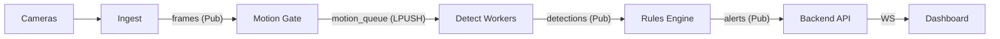

# SecureVu AI Surveillance: Comprehensive Project Guide (A to Z)

## 1. Project Vision & Overview
SecureVu is a high-performance, modular AI surveillance prototype designed for real-time video analytics. Unlike traditional "black-box" NVRs, SecureVu uses an **open-vocabulary AI stack** (YOLO-World) mixed with **specialized forensic models** (Fire, Face, License Plates) to provide intelligent, rule-based alerting.

### Core Philosophy
- **Modular Pipeline**: Each component (ingest, motion, detect, rules) is a separate process communicating via Redis.
- **Smart Filtering**: Reducing false positives by cross-referencing multiple AI models.
- **Privacy First**: Support for privacy zones and local-only processing.
- **Scalable Ingress**: Designed to handle multiple RTSP streams in parallel using multiprocessing.

---

## 2. System Architecture (The Redis Pipeline)
SecureVu is built on a **Publish/Subscribe (Pub/Sub)** architecture. Data flows through the system in stages, allowing parts to be scaled or replaced independently.

### Data Flow Breakdown
1. **Ingest (`webcam_ingest.py`)**: Captures frames from USB or RTSP. Publishes raw JPEG bytes to the `frames` channel.
2. **Motion (`motion.py`)**: Subscribes to `frames`. Performs a lightweight pixel-level delta check (`cv2.absdiff`). Only if change exceeds `MOTION_DIFF_MEAN_THRESHOLD` is the frame pushed to the `motion_queue`.
3. **Detect (`detect.py`)**: A pool of workers pulls from `motion_queue`. Runs AI inference and publishes JSON to `detections`.
4. **Rules (`rules.py`)**: Analyzes detections against zone polygons, schedules, and policies. If a rule trips, it publishes to `alerts`.
5. **Clip Buffer (`clip_buffer.py`)**: Keeps the last ~10 seconds of frames for every camera in an in-memory `deque`. When it sees a `save_clip` signal, it dumps those frames to an MP4.

---

## 3. The AI Stack: Multi-Model Intelligence
SecureVu's "brain" is a multi-stage pipeline designed for both breadth and depth.

### Stage 1: YOLO-World (Open-Vocabulary)
Traditional AI can only see what it was trained on (e.g., 80 COCO classes). SecureVu uses **YOLO-World**, allowing you to define **any prompt** in `detection_config.yaml`.
- **Current Prompts**: person, dog, cat, suitcase, wheelchair, lamp, socket, etc.
- **Advantage**: If you want to detect "yellow umbrellas," you simply add it to the YAML—no retraining required.

### Stage 2: Specialized Verification
Some events require higher precision than a general-purpose model provides.
- **Fire/Smoke**: If YOLO-World sees "fire," a heavy-duty dedicated Fire-Net runs to verify.
- **LPD (License Plate Detection)**: If a vehicle class is detected, the pipeline automatically looks for plate bboxes.
- **Face**: Integrated for presence verification.

### Stage 3: Smart Filtering (False Positive Suppression)
AI is often "tricked" by lights or sun glare. SecureVu implements **Smart Filtering** logic:
- If a "Fire" detection overlaps (high IoU) with a "Lamp" or "Socket" tag from YOLO-World, the alert is suppressed.
- This effectively uses the "context" of the scene to validate high-risk alerts.

---

## 4. Features & Logic Modules

### Zone Intelligence (`zones.yaml`)
- **Normalized Coordinates**: Polygons defined from `0.0` to `1.0`, making them resolution-independent.
- **Rule Types**:
    - `restricted`: Instant "Intrusion" alert.
    - `crowd_max`: Alert if > N people present.
    - `loitering_seconds`: Alert if person stays in zone for X seconds.
    - `hoa_vehicle_violation`: Alert if a vehicle parks in a "No Parking" zone.

### Schedules
Rules can be time-gated. For example, a "Restricted Zone" in an office might only be active from `22:00` to `06:00`.

### Clip Buffering
The `clip_buffer.py` uses a **circular memory buffer**. This allows "Pre-roll" recording—when an alert happens, the saved video includes the 10 seconds **before** the event triggered, ensuring you catch the full context.

---

## 5. Hyperparameters & Tuning
You can tune the "sensitivity" of SecureVu without changing code by editing `pipeline/detection_config.yaml`.

| Parameter | Default | Effect |
| :--- | :--- | :--- |
| `MOTION_DIFF_MEAN_THRESHOLD` | `5.0` | Lower = more sensitive to tiny movements. |
| `confidence.first_pass` | `0.08` | Detection threshold for YOLO-World. |
| `confidence.fire_verify` | `0.05` | Stricter = fewer false fire alarms. |
| `alert_cooldown_seconds` | `25` | Prevents getting 100 notifications for one person walking by. |
| `NUM_WORKERS` | `1` | Increase for multi-camera setups to maintain FPS. |
| `BATCH_SIZE` | `1` | Increase to process frames group-by-group (saves GPU overhead). |

---

## 6. Niche Technical Details (The "Under the Hood" Stuff)
- **Multiprocessing `spawn`**: We force the Python start method to `spawn` instead of `fork`. This is critical for CUDA (NVIDIA GPU) stability; `forking` a process that already initialized a GPU context usually leads to deadlocks.
- **Detection Overlay**: `clip_buffer.py` draws bounding boxes onto the frames *before* they are stored in the deque. This means the saved MP4 clips already have the AI "boxes" burned into the video.
- **MJPEG Streaming**: Live video in the dashboard is served via an MJPEG stream. The backend takes the latest JPEG from Redis and sends it over a permanent HTTP connection.
- **WebSocket Alerts**: Real-time alerts bypass the database and go straight to the UI via WebSockets for sub-second latency.

---

## 7. How to Extend
- **Add a model**: Update `models/registry.yaml` and `models/loader.py`.
- **Add a rule**: Add a branch in `rules.py`'s main loop.
- **Add a camera**: Add the RTSP URL to `cameras.yaml`.

---
*Created by Antigravity AI for SecureVu Development.*
