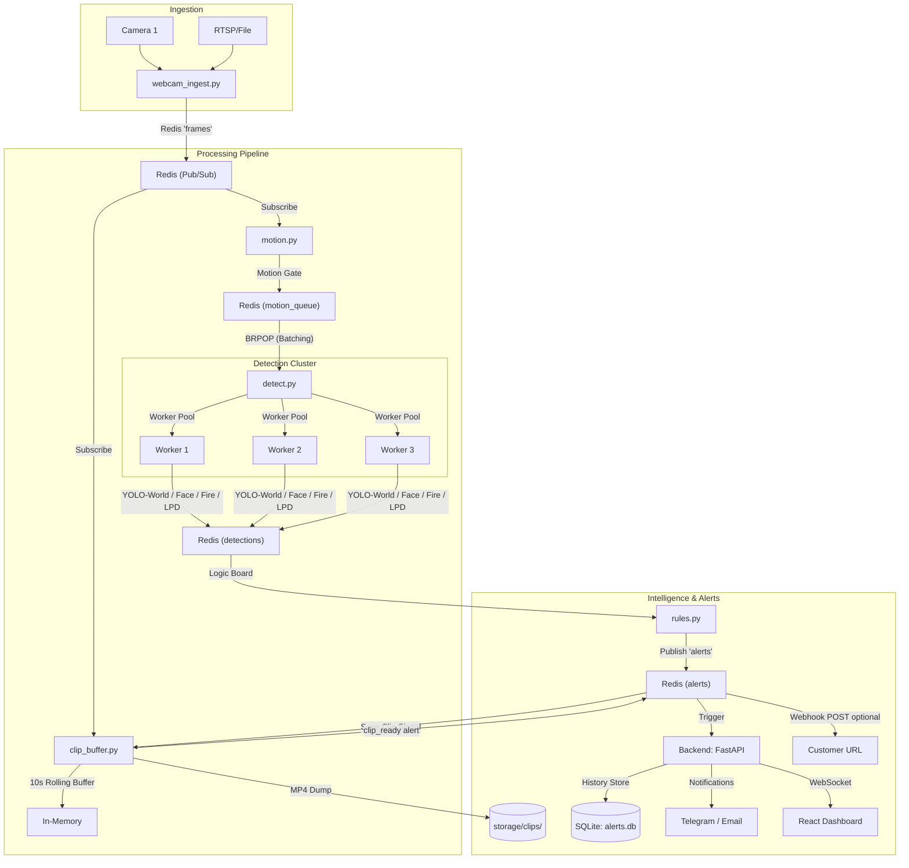

# SecureVu: AI Surveillance Prototype

SecureVu is an experimental AI video analytics stack designed for research and testing. It provides an end-to-end pipeline for real-time camera ingestion, motion-gated multi-model detection (YOLO-World, Face, Fire/Smoke, License Plates), a **rules engine** (zones, crowd, loitering, vehicle policy, configurable open-vocab alerts, optional **webhooks**), and intelligent alert dispatching with persistence and a modern dashboard.

For **future work and polish**, see [`ROADMAP.md`](ROADMAP.md).

> [!IMPORTANT]
> This system is currently in the **Prototype / Testing Phase**. It is NOT recommended for production deployment without extensive validation in your specific environment.

---

### Key Features

- **Experimental Multi-Worker Architecture**: Uses a parallel worker pool (`detect.py`) for high-throughput inference across multiple streams.
- **Open-Vocabulary Cross-Verification**: Leverages YOLO-World to filter false positives (e.g., distinguishing lamps/sockets from actual fire).
- **Rules engine** (`rules.py`): Fire/smoke priority, vehicle alerts with **allow/deny policy**, **custom open-vocab** substring rules, zone-based **intrusion / crowd / loitering** (see `pipeline/zones.yaml`).
- **Webhooks**: Optional `WEBHOOK_URL` / `WEBHOOK_URLS` — each published alert is POSTed as JSON.
- **Clips in the UI**: Saved MP4s under `storage/clips/` are served at **`/clips/...`**; `clip_buffer.py` emits a `clip_ready` alert with a link path for the dashboard.
- **Infinite Alert History**: Persistent SQLite storage (`alerts.db`) for all detected events.
- **NAS-Optimized Clip Storage**: Rolling buffer with automatic MP4 dump on selected alert types (configurable via `rules_engine.clip_on_alert_types` in `detection_config.yaml`).
- **Evaluation Framework**: Built-in scripts for measuring FPS, latency, and detection accuracy.

---

### Architecture



---

## Testing & Evaluation (CRITICAL)

Use the following tools to benchmark and verify the prototype against custom datasets (e.g., Kaggle Fire/Smoke):

- **Benchmark System Efficiency**: 
  ```bash
  python3 evaluate_pipeline.py path/to/video.mp4
  ```
  Generates `eval_report.json` with Avg FPS and per-model latency.

- **Advanced Dataset Testing**:
  ```bash
  # Run detection test with cross-verification logic
  python3 test_kaggle_fire.py path/to/dataset/video.mp4 --out result.mp4
  ```

---

## Performance & Optimization

- **TensorRT Support**: Models can be exported to `.engine` format using `models/export_trt.py` for significant FPS gains on NVIDIA hardware.
- **Detection stack**: Each motion frame runs the full stack in `detect.py`: YOLO-World + face + LPD first pass, optional dedicated **fire/smoke** model when triggered, then **vehicle LPD** when a vehicle class appears. Tune `BATCH_SIZE` (frames pulled from Redis per iteration) and `NUM_WORKERS`; defaults are `1` / `1`.
- **Smart Filtering**: The system cross-references specialized fire detections with YOLO-World context to ignore false positives like lamps, sockets, and glowing bulbs.

---

## Persistence & Storage

- **Alert History**: All alerts are automatically saved to a local SQLite database (`alerts.db`). History is preserved across restarts.
- **NAS Clip Storage**:
    - `clip_buffer.py` maintains a rolling in-memory buffer of recent frames per camera.
    - When `rules.py` publishes certain alert types (see `rules_engine.clip_on_alert_types` in `detection_config.yaml`), Redis `save_clip` triggers an MP4 dump to `CLIP_DIR` (default `storage/clips/`).
    - After save, a **`clip_ready`** alert is published so the dashboard can show an **Open recording** link (`GET /clips/<filename>` via FastAPI `StaticFiles`).
    - Mount the same directory on a NAS for long-term retention if needed.

---

## Prerequisites

| Component | Notes |
|-----------|--------|
| **Redis** | Default `localhost:6379` locally; service name `redis` in Docker Compose. |
| **Python 3.10+** | Virtualenv recommended at repo root (`venv/`). |
| **FFmpeg** | Required for `clip_buffer.py` to save MP4 files. |
| **GPU** | **NVIDIA**: `detect.py` uses **CUDA** when `torch.cuda.is_available()` (override with `DEVICE`). **Apple Silicon**: uses **MPS** when CUDA is not available. TensorRT engines (see `models/export_trt.py`) load via Ultralytics when present. |

---

## Quick start (local, no Docker)

1. **Clone and enter the repo.**

2. **Install Python dependencies**:
   ```bash
   python3 -m venv venv
   source venv/bin/activate
   pip install -r models/requirements.txt
   pip install -r backend/requirements.txt
   ```

3. **Download and Optimize Models**:
   ```bash
   bash models/setup_models.sh
   # Optional: Export to TensorRT if GPU is available
   python3 models/export_trt.py
   ```

4. **Start Redis**:
   ```bash
   brew services start redis
   ```

5. **Run the Full Stack**:
   ```bash
   python3 test_system.py
   ```
   This sets `REDIS_HOST=localhost` for all child processes. If you start pipeline scripts manually (outside `test_system.py`), export `REDIS_HOST=localhost` so they reach your local Redis—several modules default to hostname `redis` (Docker Compose).

6. **Create a user and open the UI:**
   ```bash
   curl -X POST "http://127.0.0.1:8000/auth/register?email=you@example.com&password=yourpass&role=admin"
   cd ui && npm install && npm run dev
   ```

### Automated verification (configs + API + rules import)

With the venv activated and dependencies installed (including `httpx` and `pytest` from `backend/requirements.txt`):

```bash
python3 verify_stack.py    # syntax, YAML, zone_logic, import rules, TestClient auth, optional Redis ping
pytest test_auth.py -q       # auth register/login/alerts without a running server
```

These checks do **not** load GPU models or cameras. For a full live test, run Redis and `python3 test_system.py`, then confirm streams and alerts in the UI.

---

## Environment variables

| Variable | Default (in code) | Purpose |
|----------|-------------------|---------|
| `REDIS_HOST` | `redis` in several pipeline modules; `localhost` in backend / `test_system.py` | Redis hostname. Use `localhost` for local Redis when not using Docker. |
| `NUM_WORKERS` | `1` in `detect.py` | Parallel detection worker processes; raise (e.g. `3`) when your machine can sustain it. |
| `BATCH_SIZE` | `1` in `detect.py` | Frames pulled per batch from `motion_queue`; raise (e.g. `4`–`8`) to increase throughput if VRAM allows. |
| `CLIP_DIR` | `storage/clips` (`clip_buffer.py`) | Path for alert MP4 clips. |
| `DB_PATH` | `alerts.db` (`backend/database.py`) | SQLite database path for the backend. |
| `DEVICE` | auto: **CUDA** if available, else **MPS**, else **CPU** (`detect.py`) | Override: `cpu`, `mps`, `cuda` / `gpu`, `cuda:1`, or GPU index `0`, `1`, … |
| `DETECT_LOG_DETECTIONS` | `1` (on) in `detect.py` | Print each non-empty **merged** detection list (time, camera id, all labels). Set `0` to disable. |
| `DETECT_LOG_EVERY_N_FRAMES` | `20` in `detect.py` | How often workers log aggregate frame counts. |
| `WEBHOOK_URL` | _(empty)_ | Single URL; `rules.py` POSTs JSON for each alert emitted. |
| `WEBHOOK_URLS` | _(empty)_ | Comma-separated list of URLs (overrides single-URL usage if set). |
| `ZONES_CONFIG` | `pipeline/zones.yaml` | Override path for zone definitions consumed by `rules.py`. |
| `RULES_TIMEZONE` | `UTC` | Default IANA timezone for zone `schedule` windows when a schedule block has no `timezone` key. |

Other pipeline settings live in `pipeline/cameras.yaml` (sources), `pipeline/detection_config.yaml` (thresholds, prompts, rules engine), and `pipeline/zones.yaml` (ROI polygons).

## MacBook performance tuning (Apple Silicon)

`detect.py` picks **MPS** automatically on Apple Silicon when CUDA is unavailable. Force CPU with `export DEVICE=cpu` (e.g. debugging).

- **Batching**: Set `BATCH_SIZE` and `NUM_WORKERS` in the environment or `.env` (e.g. `BATCH_SIZE=8` on Pro/Max chips).
- **Half precision (FP16)**: `evaluate_pipeline.py` passes `half=True` for benchmarks; the live `detect.py` path does not set `half=True` on inference calls—add it in code if you want FP16 there.
- **Frame skipping**: The batched worker loop skips every other queued item (`j % 2 != 0`) to reduce load and keep up with real-time feeds.

---

## Detection config (`pipeline/detection_config.yaml`)

| Key | Default in repo | Purpose |
|-----|-----------------|---------|
| `fire_verify_every_frame` | `false` | When `true`, runs the heavy fire model on every motion frame (or set env `FIRE_VERIFY_EVERY_FRAME=1`). |
| `confidence.fire_verify` | `0.05` | Dedicated fire-model confidence threshold; increase (e.g. `0.45`) for stricter alerts / fewer false positives during tuning. |
| `confidence.first_pass`, `fire_soft`, etc. | see file | YOLO-World and gating thresholds. |
| `vehicles` | see file | Each entry gets its own Redis/UI alert type: `vehicle_car`, `vehicle_bus`, `vehicle_truck`, `vehicle_auto_rickshaw`, `vehicle_motorcycle`, `vehicle_scooter` (driven by `rules.py`). |
| `yolo_world_classes` | see file | Open-vocabulary prompts for YOLO-World; extend with new lines for more objects (restart `detect.py`). |
| `rules_engine` | see file | `alert_cooldown_seconds`, `enable_generic_person_feed`, `clip_on_alert_types` (which alerts trigger `save_clip`). |
| `vehicle_policy` | `mode: all` | `deny_list` / `allow_list` with `deny` / `allow` label lists to filter vehicle alerts. |
| `open_vocab_custom` | see file | Substring → `alert_type` + label for extra YOLO-World labels (processed in `rules.py` after fire/smoke). |

`BATCH_SIZE` and `NUM_WORKERS` are **not** defined in this YAML; set them via environment variables for `detect.py`.

---

## Zone rules (`pipeline/zones.yaml`)

Camera IDs must match keys in `pipeline/cameras.yaml`. Polygons use **normalized coordinates** \([0,1]\), origin top-left.

Per zone you can set:

| Field | Meaning |
|-------|---------|
| `polygon` | List of `[x, y]` points (at least three). |
| `schedule` | Optional **time gate** (no ML): rules for this zone apply only when local time matches. Subkeys: `timezone` (IANA, e.g. `Asia/Kolkata`), optional `days` (`mon`…`sun` or `0`…`6` Mon=0), `windows` (list of `{ start, end }` as `HH:MM`; overnight allowed, e.g. `22:00`→`06:00`). |
| `restricted` | If `true`, any **person** center inside the polygon raises `zone_intrusion` (subject to global cooldown). |
| `crowd_max` | If **person** count in zone exceeds this integer, raises `zone_crowd`. |
| `loitering_seconds` | Dwell time before `zone_loitering` (continuous presence at or above `loitering_min_persons`). |
| `loitering_min_persons` | Default `1`. Set `2`+ to only alarm when **that many people** are in the zone (group / advanced loitering). |
| `hoa_vehicle_violation` or `no_vehicles_in_zone` | If `true`, any configured **vehicle** (bbox center in polygon) raises `hoa_vehicle_violation` (HOA / no-parking style). Optional `hoa_vehicle_labels: [car, motorcycle]` to restrict which classes count; default = all vehicle classes from `detection_config.yaml`. |

Default timezone for schedules: env **`RULES_TIMEZONE`** (fallback `UTC`) if a window omits per-zone `timezone`.

Restart **`rules.py`** after editing zones or detection rule sections. Restart **`detect.py`** if you change `yolo_world_classes` or model thresholds.

---

## Detection messages (`detect.py` → Redis `detections`)

Each message is JSON: `cam`, `frame` (`w`, `h`), and `detections` (each item may include `label`, `conf`, `box` as `xyxy` in **pixel** coordinates). The rules engine uses `frame` sizes to map boxes into normalized zone polygons.

---

## Dashboard (UI)

The React dashboard loads cameras from `GET /cameras`, subscribes to `WebSocket /ws` for live alerts, and supports **alert type filter**, **camera search**, **severity** styling, and **Open recording** when an alert includes `clip` (e.g. `clip_ready`).

---

## License / Ownership

SecureVu is an open-source reference architecture for AI surveillance research. Fire and smoke tuning is **highly scene-dependent**; always adjust sensitivity and motion thresholds for your specific environment.
