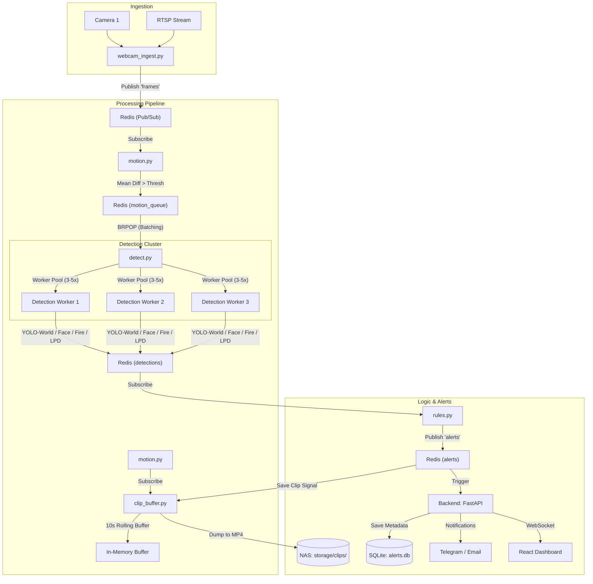

# SecureVU

End-to-end reference stack for **AI video analytics**: ingest camera frames, motion-gate them, run multi-model detection (YOLO-World, face, fire/smoke, license plates), apply rules, and push alerts to a **FastAPI** backend with a **React** dashboard (JWT + WebSocket).

---

### Architecture



---

## High Performance & Scalability

The pipeline is optimized for production-grade surveillance:
- **Parallel Workers**: `detect.py` uses a multi-processing worker pool to handle high frame rates across multiple cameras.
- **Batch Inference**: Frames are collected from Redis and processed in batches to maximize GPU/CPU utilization.
- **TensorRT Support**: Models can be exported to `.engine` format for up to 5x faster inference on NVIDIA hardware.
- **Motion Gating**: Grayscale abs-diff gating ensures AI models only run when significant activity is detected.

---

## Persistence & Storage

- **Alert History**: All alerts are automatically saved to a local SQLite database (`alerts.db`). History is preserved across restarts.
- **NAS Clip Storage**:
    - `clip_buffer.py` maintains a rolling 10-second in-memory buffer of high-quality frames.
    - When an alert is triggered, the buffer is dumped as an MP4 file to `storage/clips/`.
    - Easily mountable to 8-12TB NAS systems for long-term audit logs.

---

## Prerequisites

| Component | Notes |
|-----------|--------|
| **Redis** | Default `localhost:6379` locally; service name `redis` in Docker Compose. |
| **Python 3.10+** | Virtualenv recommended at repo root (`venv/`). |
| **FFmpeg** | Required for `clip_buffer.py` to save MP4 files. |
| **GPU** | Optional but strongly recommended for `detect.py` (Ultralytics / TensorRT). |

---

## Quick start (local, no Docker)

1. **Clone and enter the repo.**

2. **Install Python dependencies**:
   ```bash
   python3 -m venv venv
   source venv/bin/activate
   pip install -r models/requirements.txt
   pip install -r backend/requirements.txt
   ```

3. **Download and Optimize Models**:
   ```bash
   bash models/setup_models.sh
   # Optional: Export to TensorRT if GPU is available
   python3 models/export_trt.py
   ```

4. **Start Redis**:
   ```bash
   brew services start redis
   ```

5. **Run the Full Stack**:
   ```bash
   python3 test_system.py
   ```

6. **Create a user and open the UI:**
   ```bash
   curl -X POST "http://127.0.0.1:8000/auth/register?email=you@example.com&password=yourpass&role=admin"
   cd ui && npm install && npm run dev
   ```

---

## Configuration

| File / env | Purpose |
|------------|---------|
| `pipeline/cameras.yaml` | Camera IDs and sources. |
| `NUM_WORKERS` | Number of parallel detection workers (default: `3`). |
| `BATCH_SIZE` | Number of frames per inference batch (default: `4`). |
| `CLIP_DIR` | Path to save alert videos (default: `storage/clips`). |
| `DB_PATH` | Path to SQLite database (default: `alerts.db`). |
| `MOTION_DIFF_MEAN_THRESHOLD` | Motion sensitivity (default `5`). |

---

## Troubleshooting

- **Check persistence**: Use `sqlite3 alerts.db "SELECT * FROM alerts;"` to verify alerts are being recorded.
- **Check clips**: Verify `storage/clips/` contains MP4 files after a motion-triggered alert.
- **Logs**: `test_system.py` provides aggregated logs; check for "Worker started" and "Saved alert clip" messages.

---

## License / ownership

SecureVu is an open-source reference architecture for high-scale AI surveillance.
ire/smoke tuning is scene-dependent; adjust `detection_config.yaml` and motion threshold for your environment.

---

## License / ownership

Add your license and contact here if you publish the repo.
