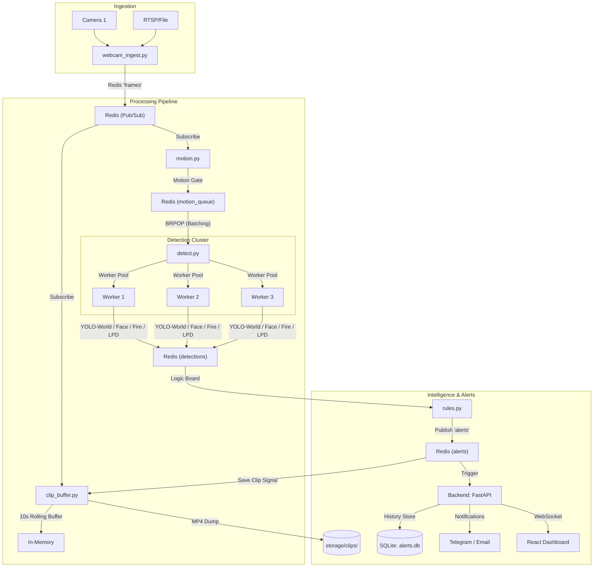

# SecureVu: AI Surveillance Prototype

SecureVu is an experimental AI video analytics stack designed for research and testing. It provides an end-to-end pipeline for real-time camera ingestion, motion-gated multi-model detection (YOLO-World, Face, Fire/Smoke, License Plates), and intelligent alert dispatching with persistence and a modern dashboard.

> [!IMPORTANT]
> This system is currently in the **Prototype / Testing Phase**. It is NOT recommended for production deployment without extensive validation in your specific environment.

---

### Key Features

- **Experimental Multi-Worker Architecture**: Uses a parallel worker pool (`detect.py`) for high-throughput inference across multiple streams.
- **Open-Vocabulary Cross-Verification**: Leverages YOLO-World to filter false positives (e.g., distinguishing lamps/sockets from actual fire).
- **Infinite Alert History**: Persistent SQLite storage (`alerts.db`) for all detected events.
- **NAS-Optimized Clip Storage**: Rolling 10-second buffer with automatic MP4 dump on alerts, ready for high-capacity storage testing.
- **Evaluation Framework**: Built-in scripts for measuring FPS, latency, and detection accuracy.

---

### Architecture



---

## Testing & Evaluation (CRITICAL)

Use the following tools to benchmark and verify the prototype against custom datasets (e.g., Kaggle Fire/Smoke):

- **Benchmark System Efficiency**: 
  ```bash
  python3 evaluate_pipeline.py path/to/video.mp4
  ```
  Generates `eval_report.json` with Avg FPS and per-model latency.

- **Advanced Dataset Testing**:
  ```bash
  # Run detection test with cross-verification logic
  python3 test_kaggle_fire.py path/to/dataset/video.mp4 --out result.mp4
  ```

---

## Performance & Optimization

- **TensorRT Support**: Models can be exported to `.engine` format using `models/export_trt.py` for significant FPS gains on NVIDIA hardware.
- **Batch Inference**: `detect.py` configures `BATCH_SIZE` and `NUM_WORKERS` to maximize GPU utilization.
- **Smart Filtering**: The system cross-references specialized fire detections with YOLO-World context to ignore false positives like lamps, sockets, and glowing bulbs.

---

## Persistence & Storage

- **Alert History**: All alerts are automatically saved to a local SQLite database (`alerts.db`). History is preserved across restarts.
- **NAS Clip Storage**:
    - `clip_buffer.py` maintains a rolling 10-second in-memory buffer of high-quality frames.
    - When an alert is triggered, the buffer is dumped as an MP4 file to `storage/clips/`.
    - Easily mountable to 8-12TB NAS systems for long-term audit logs.

---

## Prerequisites

| Component | Notes |
|-----------|--------|
| **Redis** | Default `localhost:6379` locally; service name `redis` in Docker Compose. |
| **Python 3.10+** | Virtualenv recommended at repo root (`venv/`). |
| **FFmpeg** | Required for `clip_buffer.py` to save MP4 files. |
| **GPU** | Optional but strongly recommended for `detect.py` (Ultralytics / TensorRT). |

---

## Quick start (local, no Docker)

1. **Clone and enter the repo.**

2. **Install Python dependencies**:
   ```bash
   python3 -m venv venv
   source venv/bin/activate
   pip install -r models/requirements.txt
   pip install -r backend/requirements.txt
   ```

3. **Download and Optimize Models**:
   ```bash
   bash models/setup_models.sh
   # Optional: Export to TensorRT if GPU is available
   python3 models/export_trt.py
   ```

4. **Start Redis**:
   ```bash
   brew services start redis
   ```

5. **Run the Full Stack**:
   ```bash
   python3 test_system.py
   ```

6. **Create a user and open the UI:**
   ```bash
   curl -X POST "http://127.0.0.1:8000/auth/register?email=you@example.com&password=yourpass&role=admin"
   cd ui && npm install && npm run dev
   ```

---

## Configuration

| File / env | Purpose |
|------------|---------|
| `pipeline/cameras.yaml` | Camera IDs and sources. |
| `NUM_WORKERS` | Number of parallel detection workers (default: `3`). |
| `BATCH_SIZE` | Number of frames per inference batch (default: `4`). |
| `CLIP_DIR` | Path to save alert videos (default: `storage/clips`). |
| `DB_PATH` | Path to SQLite database (default: `alerts.db`). |
## Configuration (`pipeline/detection_config.yaml`)

| Variable | Default | Purpose |
|----------|---------|---------|
| `FIRE_VERIFY_EVERY_FRAME` | `false` | Enable for intense fire testing environments. |
| `BATCH_SIZE` | `4` | Maximize based on available VRAM. |
| `NUM_WORKERS` | `3` | Parallel detection processes. |
| `confidence.fire_verify` | `0.45` | Recommended threshold for testing fire alerts. |

---

## License / Ownership

SecureVu is an open-source reference architecture for AI surveillance research. Fire and smoke tuning is **highly scene-dependent**; always adjust sensitivity and motion thresholds for your specific environment.
